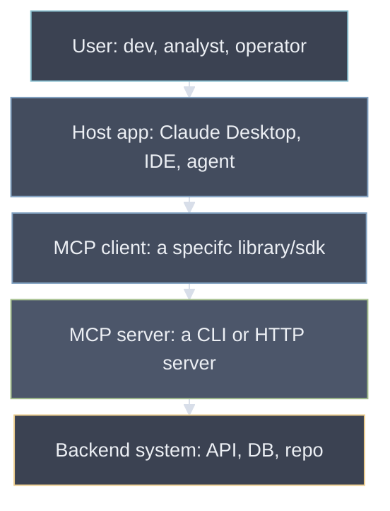
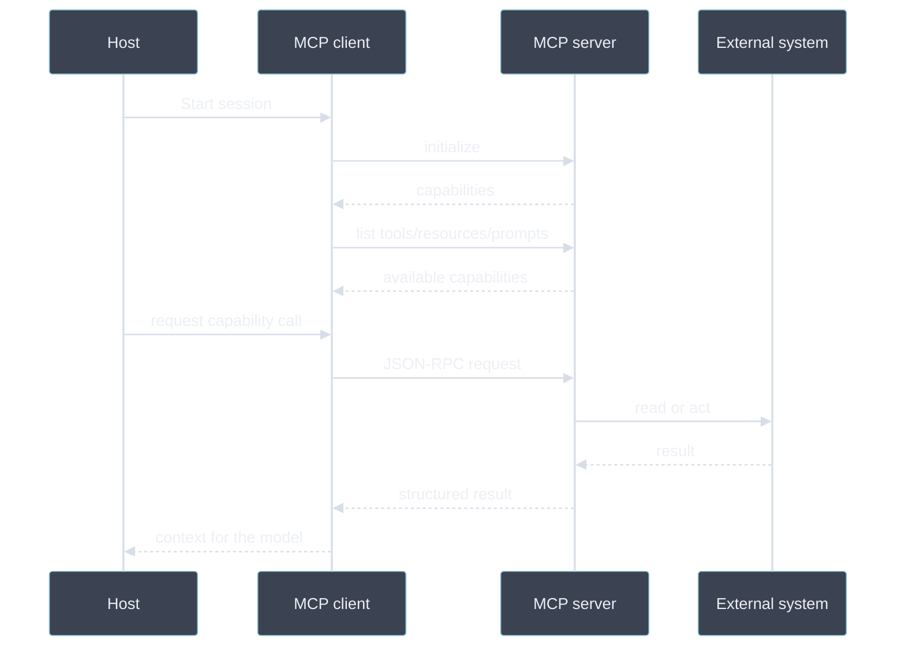
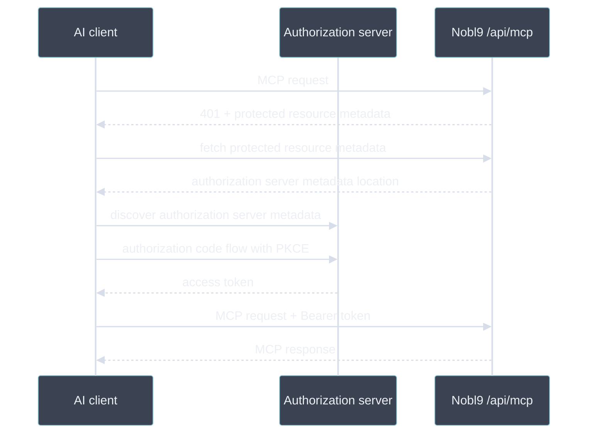
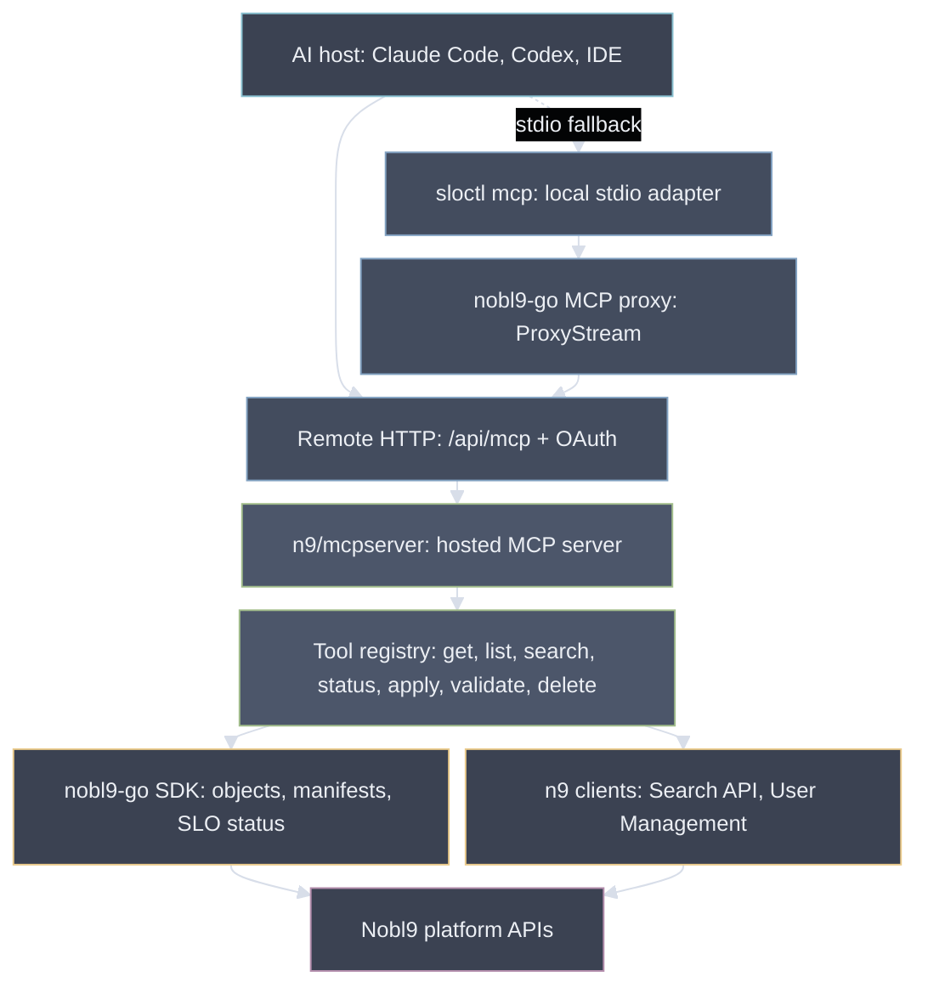

# What the heck is MCP?

MCP stands for Model Context Protocol.

It is an open protocol that integrates LLM applications and external data sources and tools.
It provides a standardized way to connect LLMs with the context they need.

## The problem

LLM applications need context and actions:

- read repository files
- query issue trackers
- inspect databases
- call internal tools
- reuse prompts and workflows

> Why not just use APIs directly?

Not every LLM client is made equal. ChatGPT in the browser does not have the same access to tools as _codex_ running in your terminal.
It can't just use _curl_ to fetch something and write a script to transform results. \
Without a shared protocol, every LLM client is forced to build custom integrations.
Furthermore, the various vendors that wish to be LLM-friendly,
would have to support each LLM client on a case by case basis.

You get the picture, we need a standard. \
Thus MCP was born. \
Is it perfect? No, but for the better or worse, we're kind of stuck with it at this point.

### When not to use it

MCP may be unnecessary when:

- a single app-specific integration is enough
- the server would only wrap one trivial HTTP call
- your agent already has access to the exposed APIs, a good example is `gh` CLI, where I don't see any point in using GitHub MCP

<!-- end_slide -->

## The actors

MCP standardizes the conversation between:

- a host application
- an MCP client inside that host
- one or more MCP servers



<!-- end_slide -->

## What a server exposes

MCP servers can expose three core capabilities:

- tools: actions the model can ask to run
- resources: readable context, such as files or records
- prompts: reusable prompt templates or workflows

Servers declare what they support.
Clients decide what to show and when to call it.

### JSON RPC 2.0

I will be showing some JSON RPC 2.0 messages, this is the language or data format MCP clients and servers use to communicate with each other. \
It is extremely simple, if you know JSON, you will find it clear as a day.

You might have seen it in the wild, or used it without knowing it.
It's used in many solutions like:

- LSP (language server protocol)
- ACP (agent communication protocol)
- A2A (agent to agent protocol)

Here's how it looks like:

```text
--> {"jsonrpc": "2.0", "method": "subtract", "params": [42, 23], "id": 1}
<-- {"jsonrpc": "2.0", "result": 19, "id": 1}

--> {"jsonrpc": "2.0", "method": "subtract", "params": [23, 42], "id": 2}
<-- {"jsonrpc": "2.0", "result": -19, "id": 2}
```

The `jsonrpc`, `id` and `method` fields are REQUIRED,
while `params` can be anything and MAY be omitted.

<!-- end_slide -->

## Tools

Tools are callable operations. \
It's the bread and butter of MCP. \
It can be anything, after all it's just an API call.

Examples:

- `search_issues`
- `read_file`
- `run_query`
- `create_ticket`

A tool has a name, description, JSON schema for both input and output, and optional structured result. This is just a simple example, it does not cover all the knobs and options:

```json
{
  "jsonrpc": "2.0",
  "id": 1,
  "result": {
    "tools": [
      {
        "name": "get_weather",
        "title": "Weather Information Provider",
        "description": "Get current weather information for a location",
        "inputSchema": {
          "type": "object",
          "properties": {
            "location": {
              "type": "string",
              "description": "City name or zip code"
            }
          },
          "required": ["location"]
        }
      }
    ]
  }
}
```

<!-- end_slide -->

## Resources

Resources are context the model can read.
They differ from tools technically in that they support lifetime management via a subscription mechanism.
This means MCP server will actively notify its clients if a given resource has changed.
In short, resources let a server expose data without pretending every read is an action.

Examples:

- `https:///repo/README.md`
- `postgres://service/orders`
- `slack://channel/release-notes`

Listing resources can yield something like this:

```json
{
  "jsonrpc": "2.0",
  "id": 1,
  "result": {
    "resources": [
      {
        "uri": "https://docs.nobl9.com/tools-and-utilities/mcp-server",
        "name": "mcp-server.md",
        "description": "Public documentation for MCP server",
        "mimeType": "text/markdown"
      }
    ]
  }
}
```

> [!WARNING] Support
> Not every MCP client supports resources.
> To be honest, I find this particular feature kind of over the top. I think tools are quite enough and resources just complicate the implementations needlessly without strong rationale behind them.

<!-- end_slide -->

## Prompts

Prompts are reusable instructions managed by a server.
Yes, these are just like the template prompts you can define in some harnesses.

Example `prompts/list` method will yield:

```json
{
  "jsonrpc": "2.0",
  "id": 1,
  "result": {
    "prompts": [
      {
        "name": "code_review",
        "title": "Request Code Review",
        "description": "Asks the LLM to analyze code quality and suggest improvements",
        "arguments": [
          {
            "name": "repo",
            "description": "The repository to review",
            "required": true
          },
          {
            "name": "owner",
            "description": "The owner of the repository",
            "required": true
          }
        ]
      }
    ]
  }
}
```

They support templating, and you call them just like functions, for instance:

```text
/code_review n9 nobl9
```

> [!WARNING] Support
> Not every MCP client supports prompts (I'm looking at you codex!), but most do.
> Unlike resources, I find prompts genuinely useful.

<!-- end_slide -->

## Other features

MCP also defines a few less common protocol features:

- sampling: servers can ask the client to run an LLM call
- elicitation: servers can ask the user for structured input
- roots: clients can tell servers which files or URIs are in scope
- completion: servers can suggest prompt arguments or resource URIs
  - I believe CC does that for Slack if you start typing `#`
- utilities: progress, cancellation, ping, logging, and pagination

> [!WARNING] Support
> Yeah, not everyone supports these.

<!-- end_slide -->

## The Protocol

### Flow

The flow of each client-server interaction is very similar to what LSP does.
First they do a handshake, client sends `initialize` request with its metadata and capabilities (what features it supports).
Then the server responds with its own capabilities and metadata.



The interaction can be stateful, there's a concept of session and session id,
but it does not need to be. In our own MCP server it is stateless and we use the session id only for logging.

### Transport

In theory you can transport JSON RPC messages over anything,
but the most common transports are:

- stdio for CLIs, like `sloctl mcp`
- streamable HTTP for remote servers, like `https://app.nobl9.com/api/mcp`

<!-- end_slide -->

## Authorization

MCP **tries** to standardize authorization mainly for remote HTTP servers. \
I say "tries", because there's a lot of MAY, CAN and SHOULD in there.
In reality, OAuth 2.0 is a very broad standard and implementations differ.
Since the MCP does not enforce any specific OAuth flows,
but merely suggests, the result is this convoluted mess where every MCP client and server does OAuth slightly different. \
And they often don't work with each other or require weird hacks.
Chances are you've been already burned by this with one of the servers you're using.

Key points:

- authorization is optional in the protocol
- HTTP servers use OAuth 2.1 patterns when they require auth
- stdio servers usually get credentials from the local environment
- clients should discover auth metadata instead of hard-coding every auth server
  - except when they don't, I'm looking at you Gemini UI!
- bearer tokens are sent with each protected HTTP request

### OAuth discovery

```bash +exec
curl -s https://app.nobl9.com//.well-known/oauth-protected-resource
```

<!-- end_slide -->

## Nobl9 auth implementation

Nobl9 uses pre-registered OAuth clients.
Dynamic Client Registration is not supported.



> [!NOTE]
> MCP server is unique in a way that it supports both machine and browser tokens.
> Why is that an issue? Browser tokens are not tied to any specific org.
> That's why, if the server detects browser token, it will dynamically change `tools/list` response to include a required `organization` argument for every tool.

<!-- end_slide -->

## Nobl9 MCP architecture



- `sloctl mcp` is not the hosted server; it is a local adapter.
- The stdio-to-HTTP proxy lives in `nobl9-go`.
- Most tools use `nobl9-go` client, which is wrapped in `pkg/sdkclient` for in-cluster traffic routing.
- Search and org lookup use `n9` service clients.

<!-- end_slide -->

## Hands on

Let's do a little bit of exploration/inspection on our own MCP server. \
There's a really useful tool here called [inspector](https://github.com/modelcontextprotocol/inspector).

Navigate to n9 repository and enter `mcpserver` folder. \
Now run:

```bash +exec
npx -y @modelcontextprotocol/inspector@latest
```

It should launch a new browser tab for you.

<!-- end_slide -->

## Summary

MCP gives AI applications a standard way to discover and call external capabilities, including authorization.

Its basic building blocks are:

- clients and servers
- tools, resources, and prompts
- JSON-RPC messages
- stdio or HTTP transports
- OAuth-based auth for protected HTTP servers

The protocol is simple (aside from auth, but when was that simple). \
But there's a good deal of tinkering in making sure LLMs work well with your server. \
Plus it all changes so fast and the adoption varies widely.

If you wanna learn more, I strongly recommend visiting https://modelcontextprotocol.io/docs/getting-started/intro.

<!-- end_slide -->

Fin.
